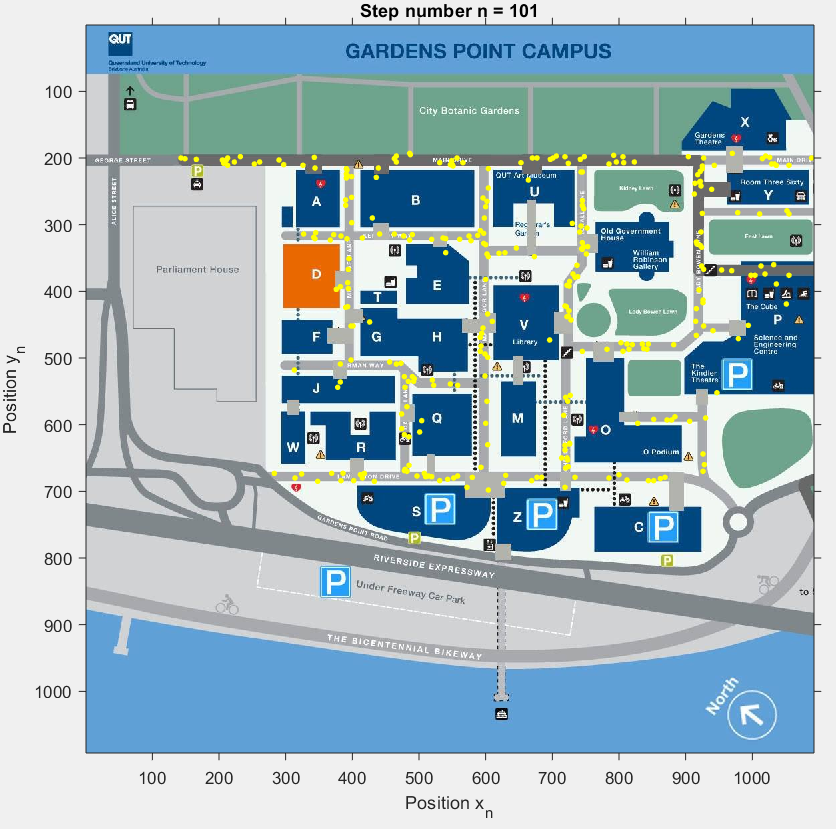
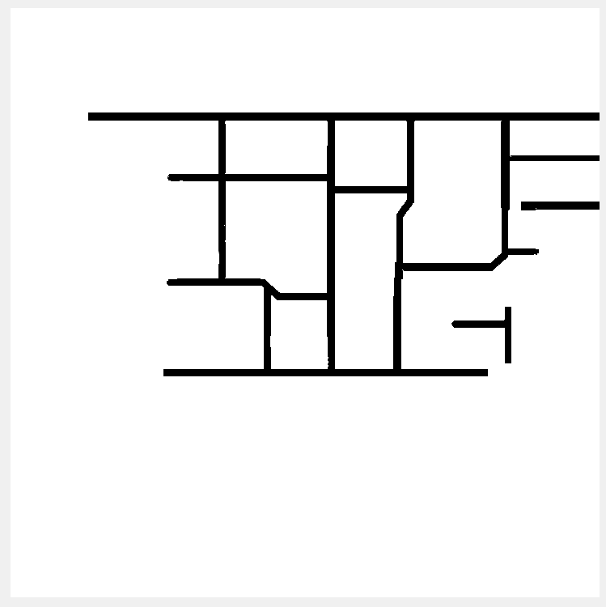

# QUT Random Walks
A Matlab simulation of a population walking around a university campus, using random walks

The behavior of a population walking around a university campus is simulated using random walks. The intent of the project was to identify which areas and buildings would be most visited, assuming a random walking behavior for the population. 

## Basic overview
Particles, representing persons on campus, are given a fixed step size, and are randomly stepped left, right, up, or down for a number of iterations. 

The probability of stepping in each direction depends on where a particle is on the map. Particles on paths are more likely to follow the direction of said paths, whilst particles at junctions, or inside buildings have equal probability of stepping in either direction.

Upon hitting a barrier (stepping outside a path, or building), particles will be 'stepped back' to ensure they are always inside a path or buiding.

An animation of the simulation can be displayed.

At the end of the simulation, a histogram is generated, detailing the visitor statistics of each building. 

# Code Structure
All source code can be found in the folder [Matlab Code](https://github.com/jyss88/QUT-Random-Walks/tree/master/Matlab%20Code)

## [random_walk_qut.m](https://github.com/jyss88/QUT-Random-Walks/blob/master/Matlab%20Code/random_walk_qut.m)
Main simulation file. Users may choose to display an animation, or to randomly distribute particles accross pathways. 

The number of particles, number of simulation steps, and deltax/deltay values may also be modified to other positive, integer numbers. 

## [generate_particles.m](https://github.com/jyss88/QUT-Random-Walks/blob/master/Matlab%20Code/generate_particles.m)
A helper function to randomly generate particles on 'allowed' areas on a map. 'Allowed' areas are indicted with a logical mask image.

Below is the logical mask image used in the simulation, to spawn particles on paths. 

## [checkhit.m](https://github.com/jyss88/QUT-Random-Walks/blob/master/Matlab%20Code/checkhit.m)
A helper function to determine which particles have collided with a barrier. Barriers are identified with a logical mask image.

## [checkout.m](https://github.com/jyss88/QUT-Random-Walks/blob/master/Matlab%20Code/checkout.m) 
A helper function to determine which particles have exited the map.

## [tally.m](https://github.com/jyss88/QUT-Random-Walks/blob/master/Matlab%20Code/tally.m)
A helper function to generate a building's visit statistics.

# Acknowledgements
This project was originally submitted as an assessment piece in 2015 at Queensland University of Technology, for the subject 'Computational Explorations' (course code MXB161), whereupon it recieved a grade of high distinction. 

Some revisions have been make to make the code more presentable to a general audience.

This project was completed in collaboration with fellow QUT students James Buckland, Alison Driver, [Kent Lowrey](mailto:kentos123@live.com), and Caity Strachan.
